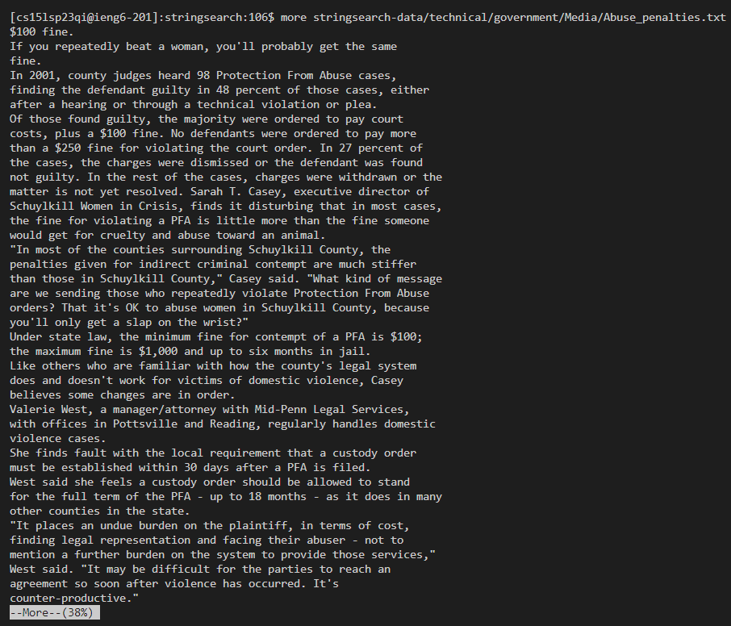
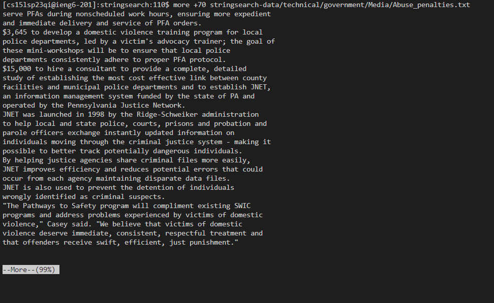
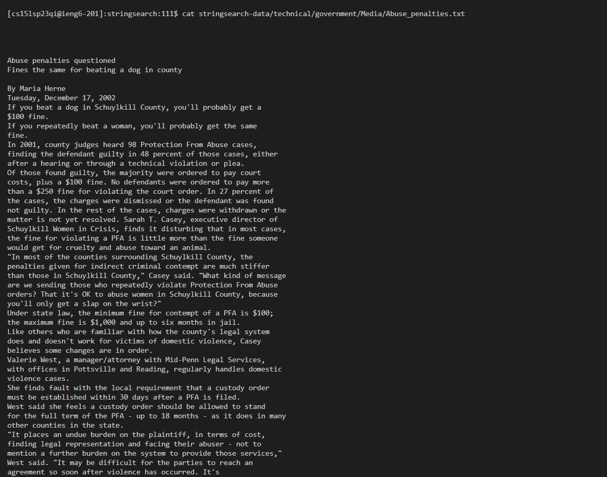
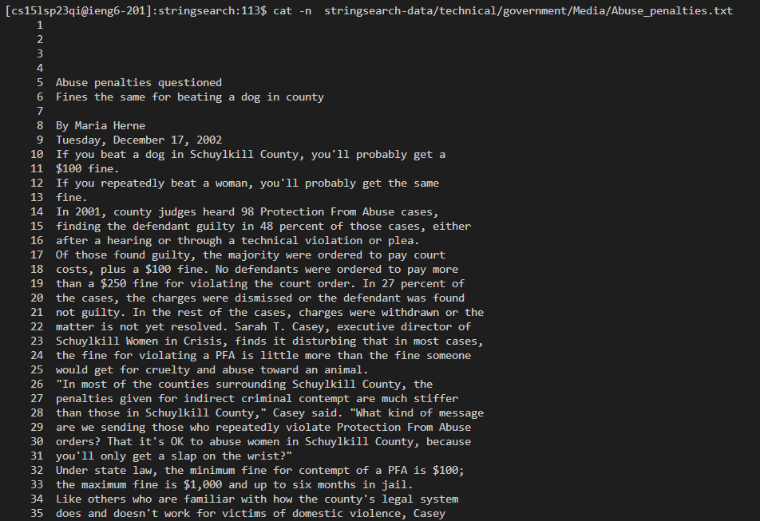

# Lab Report 3

## Of the 3 commands, I had chose ***Less*** and I had found 4 other alternatives (With the help of ChatGPT)

### These are the 4 commands that I had found

- `more`
- `cat`
- `head`
- `tail`

---
## `More`

- For this command, I had used the website [https://www.lifewire.com/more-command-4041467](https://www.lifewire.com/more-command-4041467)
- Similar to `less`, it gives us a way to view txt files but with different features. If it is too large, it shows you a portion, and you are able to control
whenever it goes down for the rest of the text. You could use s or d and b to go up or down respectively 

### **Example 1**

* The command I used was `more stringsearch-data/technical/government/Media/Abuse_penalties.txt`

As seen in this case, it does not show the whole thing and gives us the option to go up or down depending on what you want to do.

### **Example 2**

* The command I used was `more +70 stringsearch-data/technical/government/Media/Abuse_penalties.txt`

For this, it will show the text from 70 lines and after, so anything before that would not appear on the command line
---

## `Cat`
- The link that I had used to help me was [https://www.tecmint.com/13-basic-cat-command-examples-in-linux/](9https://www.tecmint.com/13-basic-cat-command-examples-in-linux/)
- For this command, it gives us the option to concatenate and is able to display one or more files. It does not give the navigation access like `less` but it helps to quickly see different files. 

### **Example 1**

* The command that I used was `cat stringsearch-data/technical/government/Media/Abuse_penalties.txt`

For this, the `cat` command just prints out whatever is in the Abuse_penalties.txt, so you do not have to press any buttons to get the other parts as it is all there

### **Example 2**

* The command that I used was `cat stringsearch-data/technical/government/Media/Abuse_penalties.txt`

