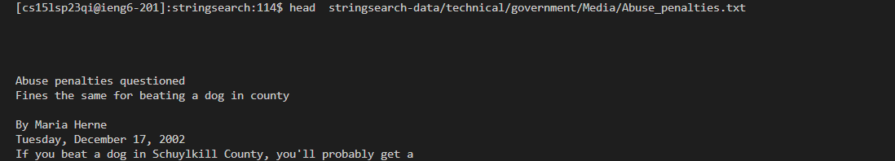
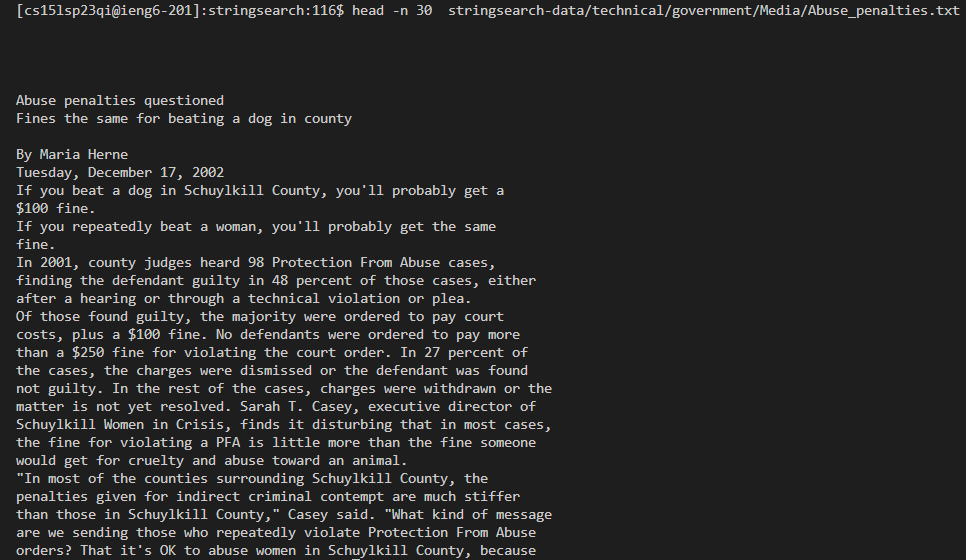
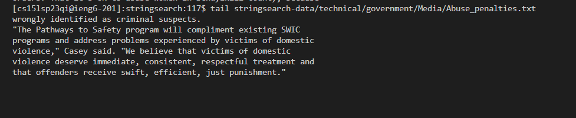
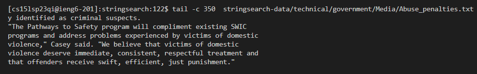

# Lab Report 3

## Of the 3 commands, I had chose ***Less*** and I had found 4 other alternatives (With the help of ChatGPT)

### These are the 4 commands that I had found

- `more`
- `cat`
- `head`
- `tail`

---
## `More`

- For this command, I had used the website [https://www.lifewire.com/more-command-4041467](https://www.lifewire.com/more-command-4041467)
- Similar to `less`, it gives us a way to view txt files but with different features. If it is too large, it shows you a portion, and you are able to control
whenever it goes down for the rest of the text. You could use s or d and b to go up or down respectively 

### **Example 1**

* The command I used was `more stringsearch-data/technical/government/Media/Abuse_penalties.txt`

As seen in this case, it does not show the whole thing and gives us the option to go up or down depending on what you want to do.

### **Example 2**

* The command I used was `more +70 stringsearch-data/technical/government/Media/Abuse_penalties.txt`

For this, it will show the text from 70 lines and after, so anything before that would not appear on the command line
---

## `Cat`
- The link that I had used to help me was [https://www.tecmint.com/13-basic-cat-command-examples-in-linux/](9https://www.tecmint.com/13-basic-cat-command-examples-in-linux/)
- For this command, it gives us the option to concatenate and is able to display one or more files. It does not give the navigation access like `less` but it helps to quickly see different files. 

### **Example 1**

* The command that I used was `cat stringsearch-data/technical/government/Media/Abuse_penalties.txt`

For this, the `cat` command just prints out whatever is in the Abuse_penalties.txt, so you do not have to press any buttons to get the other parts as it is all there

### **Example 2**

* The command that I used was `cat -n stringsearch-data/technical/government/Media/Abuse_penalties.txt`

This gives a number to each of the line in the file. If  you possibly want to isolate a certain line from a file this could be handy to find the exact line number it is on.
---
## `Head`

- The link that I used to help me with this is [https://www.geeksforgeeks.org/head-command-linux-examples/](https://www.geeksforgeeks.org/head-command-linux-examples/)
- For this command, `head` on its own will produce only the first 10 lines of a file. This will help if you would want to just quickly view a bit of the file's starting contents, similar to one of the `cat` commands that you could do.

### Example 1

* The command that I used was `head stringsearch-data/technical/government/Media/Abuse_penalties.txt`

As seen, it gives the first 10 lines with no other parameters, allowing you to see a preview of a file, which could he helpful if you don't have the time to see the whole thing.

### Example 2 

* The command that I had used was `head -n 30 stringsearch-data/technical/government/Media/Abuse_penalties.txt`
* 
With this, you have a lot more freedom with how many lines you want to see at the start, which gives you the choice to see how many lines you need out of the file you are using this command with.
---
## `Tail`
- To help me, I used this website: [https://www.geeksforgeeks.org/tail-command-linux-examples/](https://www.geeksforgeeks.org/tail-command-linux-examples/)
- `Tail` is a complimentary to `head`, as without any additional input it will just give you the last 10 lines of the file that you had chose.

### Example 1
- I used this code: `tail stringsearch-data/technical/government/Media/Abuse_penalties.txt`

- As seen, it will only give you the last few lines of the file that you had choseN. If there is no parameter that you use, it will only give the last 10 lines. If you want to see.

### Example 2
-I had used this code: `tail -c 350 stringsearch-data/technical/government/Media/Abuse_penalties.txt`

- The `-c` command is to help us find out the last 350 bytes of the file. In this case, bytes would equal one character of a word, so it would give us a precise amount of words or phrases from the end that we need. A cool thing is that since `head` is its complimentary, it also has the ability, just this time from the front.
---
### Overall, these implementations can be an alternative to the `less` command. However, it is in your best interest on what you need from the command line, you have possibly many other options than this too so get to looking!
